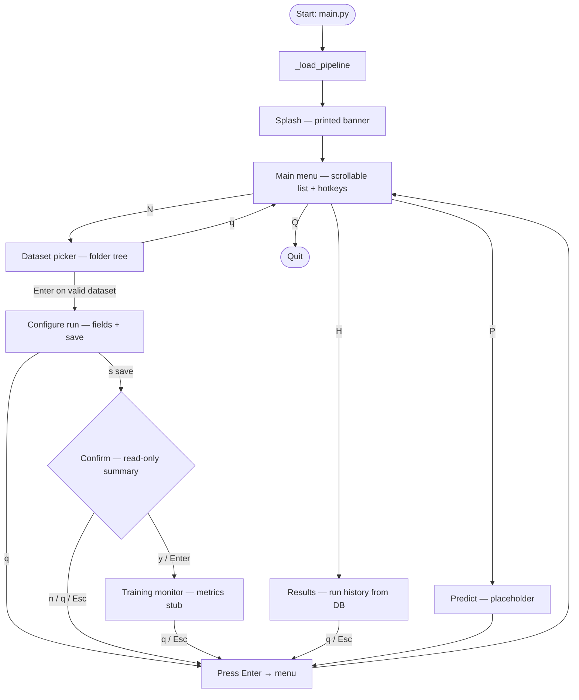

# SharedComputing Terminal

A **terminal-first** flow for configuring an image-classification-style training run: pick a dataset folder, choose an **architecture** to train **from scratch** (random initialization), set hyperparameters, review, and confirm. The UI uses **curses** full-screen views where possible (with **stdio** fallbacks), a **muted red** palette, and Unicode rules and boxes sized to the current terminal width.

## Requirements

- **Python 3.9+** (3.10+ recommended).
- A **Unicode-capable terminal** (UTF-8). **ncurses** support is required for the interactive screens; macOS Terminal, iTerm2, and most Linux terminals work out of the box.
- **Unix-like environment** for the main menu’s raw key input (`termios` / `tty`), e.g. **macOS** or **Linux**. On Windows, use **WSL** or a comparable environment.

Third-party packages are **not** required; everything uses the Python standard library.

## Quick start

```bash
python3 main.py
```

Startup loads the pipeline modules, prints the **splash** (static banner), then the **main menu**. Use the keys below to move between screens; the next section walks through each stop in order.

## Screen flow

High-level routes from [`main.py`](main.py) → [`main_menu.run()`](main_menu.py):



### New run (**N**)

| Step | Screen | Module | How you move forward | How you go back / exit |
|------|--------|--------|----------------------|-------------------------|
| 1 | Splash | `splash.py` | (automatic; banner only) | — |
| 2 | Main menu | `main_menu.py` | Press **N** | **Q** quits the app |
| 3 | Dataset picker | `dataset_picker.py` | **Enter** on a folder that passes validation | **q** or **Esc** cancels (returns to menu; no configure step) |
| 4 | Configure run | `run_config.py` | **S** saves → writes `runtime/run_config.json` | **Q** or **Esc** cancels without saving |
| 5 | Review / confirm | `confirm.py` | **Y** or **Enter** confirms | **N**, **Q**, or **Esc** cancels (config file may still exist from step 4) |
| 6 | Training monitor | `training_monitor.py` | **Q** or **Esc** closes the monitor | — |

If you cancel the dataset picker (**3**), the app returns to the menu immediately (no “Press Enter” line). After **3** succeeds, any later exit from configure (**4**), confirm (**5**), or the monitor (**6**) is followed by **Press Enter to return to the menu…** before the main menu redraws.

### Results (**H**)

| Screen | Module | Forward | Back |
|--------|--------|---------|------|
| Results list | `results.py` | **Q** / **Esc** exits the full-screen view | **Enter** after the stdio fallback, or the same keys in curses |

Then **Press Enter to return to the menu…** and the main menu appears again.

### Other keys

| Key | Where it goes |
|-----|----------------|
| **P** | Placeholder message; **Enter** returns to the menu. |
| **Q** (on main menu) | Exits the program. |

Inside **Configure run** (curses): **↑↓** move, **Enter** edits the highlighted row (dataset row opens the folder tree again), **S** save, **Q** cancel.

## Dataset layout

The dataset root must contain **one subdirectory per class**, with image files inside (see supported extensions in `dataset_picker.py`). The picker validates this layout before accepting a folder.

## Configuration

- **`DATASET_ROOT`** — If set, run configuration can use that path (see `run_config.py`). Choosing a folder in the picker updates this for the process.
- Saved settings are written to **`runtime/run_config.json`** (schema version 2 includes `training_mode: "from_scratch"`). Create the `runtime/` directory or let the app write there.

## Menu shortcuts (summary)

| Key | Action |
|-----|--------|
| **N** | New run: dataset picker → configure run → confirm → training monitor |
| **H** | Results — browse `runtime/results.db` runs |
| **P** | Predict (placeholder) |
| **Q** | Quit |

## Documentation in this repo

- **[`FILES.md`](FILES.md)** — What each module does and how to run pieces alone.
- **[`DESIGN.md`](DESIGN.md)** — Colors, typography, dividers, and UI conventions.
